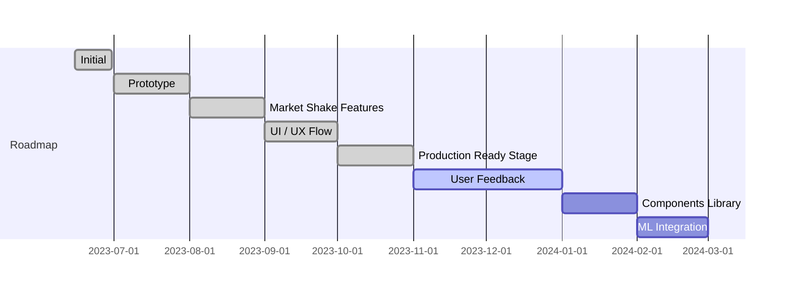

[ English | [Deutsch](./README_de.md) | [简体中文](./README_zh-CN.md) ]

#  Financial Accounting Application
 

**Fingrom** -- open-source cross-platform financial accounting application without Ads and limitations.
The goal of the solution is to create a financial accounting application that is intuitive, efficient, and inclusive. 
That empowers users to effortlessly manage their finances while ensuring that no one is left behind.

| Type                     | Alpha Version         | Pre-Release                   | Release                       |
| ------------------------ | ----------------------| ----------------------------- | ----------------------------- |
|  iOS (Apple Store)        | [fingrom_iOS.ipa](https://github.com/lyskouski/app-finance/releases/latest) | [TestFlight: Fingrom](https://testflight.apple.com/join/93ECy9ZB) |  |
|  macOS (Apple Store)      | [fingrom_macOS.zip](https://github.com/lyskouski/app-finance/releases/latest) | Not available for testing |  |
|  Android (Google Play)    | [fingrom_Android.aab](https://github.com/lyskouski/app-finance/releases/latest) | [[on hold]](https://github.com/lyskouski/app-finance/issues/129) | [[on hold]](https://github.com/lyskouski/app-finance/issues/129) |
|  Android (Galaxy Store)   | [fingrom_Android.aab](https://github.com/lyskouski/app-finance/releases/latest) | [Galaxy Store](https://galaxystore.samsung.com/detail/com.tercad.fingrom) |  |
|  Android (Huawei Gallery) | [fingrom_Android.aab](https://github.com/lyskouski/app-finance/releases/latest) | [App Gallery](https://appgallery.huawei.com/#/app/C109437079) |  |
|  Linux (Snap Store)       | [fingrom_LinuxSnap.snap](https://github.com/lyskouski/app-finance/releases/latest) |  |  |
|  Linux (Flathub)          | [fingrom_LinuxFlatpak.flatpak](https://github.com/lyskouski/app-finance/releases/latest)  | Not available |  |
|  Linux (AppImage)         | [pending] | [pending] | [pending] |
|  Windows (Partner Center) | [fingrom_Windows.zip](https://github.com/lyskouski/app-finance/releases/latest) | [App Center: Fingrom](https://appcenter.ms/orgs/terCAD/apps/Fingrom) |  |
|  Web                      | [fingrom_Web.tar.gz](https://github.com/lyskouski/app-finance/releases/latest) | [GitHub Pages: Fingrom](https://lyskouski.github.io/app-finance/) | [terCAD: Fingrom](https://tercad.com/app/finance/index.html) |

## Functionality
- Accounting (Account Type, Currency/Cryptocurrency)
  - Simple grouping via `/` (in name) for the main page
  - Transactions log
  - Freeze amount by Update date (to import previous history)
- Budget Categories
  - Simple grouping via `/` (in name) for the main page
  - With limits restate:
    - Renewed at the beginning of each month
    - Configurable limits per month
    - Relatives (0.0 ... 1.0) to Income
  - Or, without limitations by showing a spent amount
- Bills, Transfers, Incomes (Invoices)
- Goals Definition
- Exchange rates, Default Currency for Summary
- Metrics: 
  - Budget:
    - Forecast (with Monte Carlo simulation)
  - Account:
    - Candlestick (OHLC) Chart
    - Income Health Radar
    - Currency Distribution
  - Bills:
    - YTD Expenses
    - Bar Race for Categories
  - Goals Gauge Chart
  - Currency Historical Chart
- [[demo]](https://youtu.be/RccQ8JpfJs4) Synchronization between devices (P2P) 
- Recovery via WebDav or a direct File
- Import from `CSV`, `QIF`, `OFX` files for Bills and Invoices
- Data encryption
- Localization: 8 languages
- User Experience
  - Configurable Main Page (multiple configurations per `width x height` set)
  - Responsive & Adaptive Design
    - Adaptive navigation panel (top, bottom, right) and tabs (top, left)
  - Theme Mode (dark, light, system) with Palette definition (system, custom, personal -- colors selector)
  - Preserve last choice for Account, Budget, and Currency
  - Auto-scroll to the focused element on Form
  - Expand / Collapse sections on Main Page
  - Swipe for a quick access to Edit and Delete actions
  - Zoom in/out (from 60% up to 200%) via "Settings"
  - Shortcuts

| Description                         | Shortcut                       |
| ----------------------------------- | ------------------------------ |
| Open / Close the Navigation Drawer  | `Shift` + `Enter`              |
| Navigate Up                         | `up`                           |
| Navigate Down                       | `down`                         |
| Open Selected                       | `Enter`                        |
| Zoom In                             | `Ctrl` + `+`                   |
| Zoom In (with mouse)                | `Ctrl` + `scroll down`         |
| Zoom Out                            | `Ctrl` + `-`                   |
| Zoom Out (with mouse)               | `Ctrl` + `scroll up`           |
| Reset Zoom                          | `Ctrl` + `0`                   |
| Add new Transaction                 | `Ctrl` + `N`                   |
| Return Back                         | `Ctrl` + `Backspace`           |
<!--
| Edit Selected Item                  | `Ctrl` + `E`                   |
| Delete Selected Item                | `Ctrl` + `D`                   |
-->

## Support (Sponsorship)

As an open-source project, subscribing will not unlock any additional features in the app. However, it would serve as 
an investment in the continuous evolution and improvement of the application. So, if you'd like to contribute 
financially towards the efforts, please consider these options:

* [Github Sponsorship](https://github.com/users/lyskouski/sponsorship)
* [Paypal](https://www.paypal.me/terCAD)
* [Patreon](https://www.patreon.com/terCAD)
* [Donorbox](https://donorbox.org/tercad)

Or, [treat me to :coffee:](https://www.buymeacoffee.com/lyskouski).

## Contributions

Any made contribution **is greatly appreciated** (also, by mentioning in `Contributors` section, `Release` notes, and 
in the app `About` - `Contributors` as a gratitude), check [Contribution Section](./CONTRIBUTING.md) for more details.

However, if it's been chosen a contribution (not just typo corrections) to this repo, you agree that you're giving
me a non-exclusive license to use that content, as I (and my possible team) deem appropriate. You probably guessed 
that already, but I just wanted to be extra clear on that.

## License & Copyright

The content herein are all &copy; 2023 **terCAD** Team (Viachaslau Lyskouski).

 This work is licensed under a <a rel="license" href="http://creativecommons.org/licenses/by-nc-nd/4.0/">Creative Commons Attribution-NonCommercial-NoDerivs 4.0 Unported License</a>:
- **Attribution**: provide a link to the license, and indicate if changes were made
- **NonCommercial**: cannot be used as a part of a commercial solution
- **NoDerivatives**: any modification (remix, transform, or build upon the material) cannot be distributed by your own. 
  Push it back to the main repository (https://github.com/lyskouski/app-finance) to unblock the distribution for made 
  changes.
