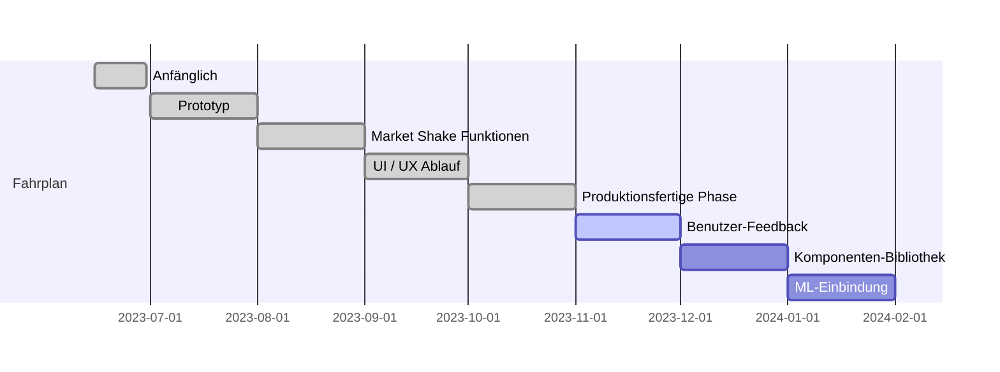

[ [English](./README.md) | Deutsch | [简体中文](./README_zh-CN.md) ]

#  Anwendung Finanzbuchhaltung
 

**Fingrom** -- plattformübergreifende Open-Source-Anwendung für die Finanzbuchhaltung ohne Ads und Einschränkungen. Das 
Ziel der Lösung ist es, eine Finanzbuchhaltungsanwendung zu schaffen, die intuitiv, effizient und umfassend ist. Sie 
ermöglicht es den Nutzern, ihre Finanzen mühelos zu verwalten und gleichzeitig sicherzustellen, dass niemand 
zurückgelassen wird.

| Typ                      | Alpha-Version         | Vorabversion                  | Freigabe                      |
| ------------------------ | ----------------------| ----------------------------- | ----------------------------- |
|  iOS (Apple Store)        | [fingrom_iOS.ipa](https://github.com/lyskouski/app-finance/releases/latest) | [TestFlight: Fingrom](https://testflight.apple.com/join/93ECy9ZB) |  |
|  macOS (Apple Store)      | [fingrom_macOS.zip](https://github.com/lyskouski/app-finance/releases/latest) | Nicht verfügbar für Tests |  |
|  Android (Google Play)    | [fingrom_Android.aab](https://github.com/lyskouski/app-finance/releases/latest) | [[in Wartestellung]](https://github.com/lyskouski/app-finance/issues/129) | [[in Wartestellung]](https://github.com/lyskouski/app-finance/issues/129) |
|  Android (Galaxy Store)   | [fingrom_Android.aab](https://github.com/lyskouski/app-finance/releases/latest) | [Galaxy Store](https://galaxystore.samsung.com/detail/com.tercad.fingrom) |  |
|  Android (Huawei Gallery) | [fingrom_Android.aab](https://github.com/lyskouski/app-finance/releases/latest) | [App Gallery](https://appgallery.huawei.com/#/app/C109437079) |  |
|  Linux (Snap Store)       | [fingrom_LinuxSnap.snap](https://github.com/lyskouski/app-finance/releases/latest) |  |  |
|  Linux (Flathub)          | [fingrom_LinuxFlatpak.flatpak](https://github.com/lyskouski/app-finance/releases/latest)  | Not available |  |
|  Linux (AppImage)         | [anhängig] | [anhängig] | [anhängig] |
|  Windows (Partner Center) | [fingrom_Windows.zip](https://github.com/lyskouski/app-finance/releases/latest) | [App Center: Fingrom](https://appcenter.ms/orgs/terCAD/apps/Fingrom) |  |
|  Web                      | [fingrom_Web.tar.gz](https://github.com/lyskouski/app-finance/releases/latest) | [GitHub Pages: Fingrom](https://lyskouski.github.io/app-finance/) | [terCAD: Fingrom](https://tercad.com/app/finance/index.html) |

## Funktionalität
- Buchhaltung (Kontotyp, Währung/Kryptowährung)
  - Einfache Gruppierung über `/` (im Namen) für die Hauptseite
  - Transaktionsprotokoll
  - Einfrieren von Beträgen nach Aktualisierungsdatum (um frühere Historie zu importieren)
- Budget-Kategorien
  - Einfache Gruppierung über `/` (im Namen) für die Hauptseite
  - Mit Limits wiederherstellen:
    - Erneuert am Anfang eines jeden Monats
    - Konfigurierbare Limits pro Monat
    - Relativ (0.0 ... 1.0) zum Einkommen
  - Oder ohne Einschränkungen durch Anzeige eines ausgegebenen Betrags
- Rechnungen, Überweisungen, Einkünfte (Rechnungen)
- Ziele Definition
- Wechselkurse, Standardwährung für Zusammenfassung
- Metriken: 
  - Budget:
    - Vorhersage (mit Monte-Carlo-Simulation)
  - Konto:
    - Candlestick (OHLC) Diagramm
    - Einkommensgesundheits-Radar
    - Währungsverteilung
  - Rechnungen:
    - YTD-Ausgaben
    - Balkenrennen für Kategorien
  - Ziele-Gauge-Diagramm
  - Historisches Währungsdiagramm
- [[demo]](https://youtu.be/RccQ8JpfJs4) Synchronisation zwischen Geräten (P2P)
- Wiederherstellung über WebDav oder eine direkte Datei
- Import von `CSV`, `QIF`, `OFX` Dateien für Rechnungen und Abrechnungen
- Verschlüsselung der Daten
- Lokalisierung: 8 Sprachen
- Benutzerfreundlichkeit
  - Konfigurierbare Hauptseite (mehrere Konfigurationen pro `Breite x Höhe` eingestellt)
  - Reaktionsfähiges & adaptives Design
    - Adaptives Navigationspanel (oben, unten, rechts) und Registerkarten (oben, links)
  - Themenmodus (dunkel, hell, System) mit Palettendefinition (System, benutzerdefiniert, persönlich - Farbauswahl)
  - Letzte Auswahl für Konto, Budget und Währung beibehalten
  - Automatischer Bildlauf zum fokussierten Element im Formular
  - Erweitern/Komprimieren von Abschnitten auf der Hauptseite
  - Streichen für einen schnellen Zugriff auf die Aktionen Bearbeiten und Löschen
  - Vergrößern/Verkleinern (von 60% bis 200%) über "Einstellungen"
  - Shortcuts

| Beschreibung                        | Shortcut                       |
| ----------------------------------- | ------------------------------ |
| Öffnen / Schließen der Navigationsschublade | `Shift` + `Enter`      |
| Nach oben navigieren                | Nach oben                      |
| Nach unten navigieren               | Nach unten                     |
| Ausgewählte öffnen                  | Enter                          |
| Vergrößern                          | `Strg` + `+`                   |
| Vergrößern (mit der Maus)           | `Strg` + nach unten scrollen   |
| Verkleinern                         | `Strg` + `-`                   |
| Herauszoomen (mit der Maus)         | `Strg` + nach oben rollen      |
| Zoom zurücksetzen                   | `Strg` + `0`                   |
| Neue Transaktion hinzufügen         | `Strg` + `N`                   |
| Zurückkehren                        | `Strg` + `Backspace`           |
<!--
| Selektiertes Element bearbeiten     | `Strg` + `E`                   |
| Ausgewählten Eintrag löschen        | `Strg` + `D`                   |
-->

## Unterstützung (Sponsoring)

Da es sich um ein Open-Source-Projekt handelt, werden durch ein Abonnement keine zusätzlichen Funktionen in der App 
freigeschaltet. Es dient jedoch als eine Investition in die kontinuierliche Weiterentwicklung und Verbesserung der 
Anwendung. Wenn Sie also einen Beitrag leisten möchten finanziell unterstützen möchten, sollten Sie diese Möglichkeiten 
in Betracht ziehen:

* [Github Sponsorship](https://github.com/users/lyskouski/sponsorship)
* [Paypal](https://www.paypal.me/terCAD)
* [Patreon](https://www.patreon.com/terCAD)
* [Donorbox](https://donorbox.org/tercad)

Or, [mich zum :coffee: einladen](https://www.buymeacoffee.com/lyskouski).

## Beiträge

Jeder geleistete Beitrag **ist sehr willkommen** (auch durch Erwähnung im Abschnitt `Contributors`, `Release` Notes, 
und in der App `About` - `Contributors` als Dankeschön), siehe [Contribution Section](./CONTRIBUTING_de.md) für weitere 
Details.

Wenn es jedoch als Beitrag (nicht nur Tippfehlerkorrekturen) zu diesem Repo ausgewählt wurde, stimmen Sie zu, dass Sie 
eine nicht-exklusive Lizenz erteilen, diesen Inhalt so zu verwenden, wie ich (und mein mögliches Team) es für angemessen 
halten. Sie haben das wahrscheinlich schon erraten aber ich wollte das nur besonders deutlich machen.

## Lizenz & Copyright

Die hierin enthaltenen Inhalte sind alle &copy; 2023 **terCAD** Team (Viachaslau Lyskouski).

 Dieses Werk ist lizenziert unter einer <a rel="license" href="http://creativecommons.org/licenses/by-nc-nd/4.0/">Creative Commons Attribution-NonCommercial-NoDerivs 4.0 Unported License</a>:
- **Attribution**: Geben Sie einen Link zur Lizenz an, und geben Sie an, ob Änderungen vorgenommen wurden
- **NonCommercial**: darf nicht für kommerzielle Zwecke verwendet werden
- **NoDerivatives**: Jede Modifikation (Remix, Transformation oder Aufbau auf dem Material) darf nicht selbst 
  weitergegeben werden. Pushen Sie es zurück in das Hauptrepository (https://github.com/lyskouski/app-finance), um die 
  Verteilung für vorgenommene Änderungen freizugeben.
