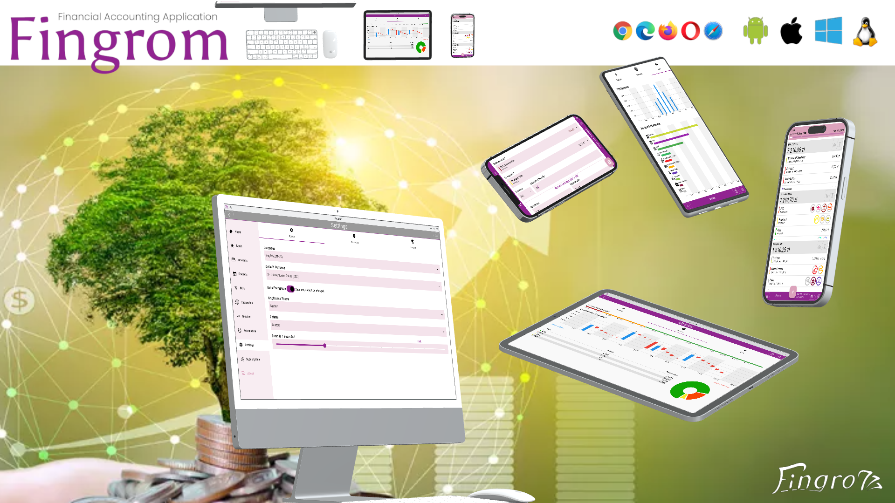

[اللغة العربية (AR)](./about_ar.md) |
[Azərbaycanlı (AZ)](./about_az.md) |
[Latsinka (BE)](./about_be_EU.md) |
[Тарашкевіца (BE)](./about_be.md) |
[Čeština (CS)](./about_cs.md) |
[Deutsch (DE)](./about_de.md) |
[English (EN-US)](./about_en.md) |
[Español (ES)](./about_es.md) |
[فارسی (FA)](./about_fa.md) |
[Français (FR)](./about_fr.md) |
[हिंदी (HI-IN)](./about_hi.md) |
Bahasa Indonesia (ID) |
[Italiano (IT)](./about_it.md) |
[日本語 (JA)](./about_ja.md) |
[ქართული (KA-GE)](./about_ka.md) |
[한국어 (KO)](./about_ko.md) |
[Nederlandse (NL)](./about_nl.md) |
[Polski (PL)](./about_pl.md) |
[Português Europeu (PT)](./about_pt.md) |
[Português Brasileiro (PTB)](./about_pt_BR.md) |
[Limba română (RO)](./about_ro.md) |
[Русский (RU)](./about_ru.md) |
[Türk dili (TR)](./about_tr.md) |
[Українська (UK-UA)](./about_uk.md) |
[简体中文 (ZH-CN)](./about_zh.md) |
[繁體中文 (ZH-TW)](./about_zh_TW.md) |

---

**Fingrom** -- aplikasi akuntansi keuangan lintas platform open-source tanpa iklan dan batasan.
Tujuan solusi ini adalah menciptakan aplikasi akuntansi keuangan yang intuitif, efisien, dan inklusif.
Yang memberdayakan pengguna untuk mengelola keuangan mereka dengan mudah sambil memastikan bahwa tidak ada yang tertinggal.

### Fungsionalitas
- Akuntansi (Jenis Akun, Mata Uang/Kriptomata Uang)
  - Pengelompokan sederhana melalui simbol `/` (dalam nama) untuk halaman utama
  - Pengurutan berdasarkan total, tanggal, dan judul
  - Log transaksi
  - Pembekuan jumlah berdasarkan tanggal Pembaruan (untuk mengimpor riwayat sebelumnya)
- Kategori Anggaran
  - Pengelompokan sederhana melalui simbol `/` (dalam nama) untuk halaman utama
  - Pengurutan berdasarkan total, tanggal, dan judul
  - Dengan batas yang diperbarui:
    - Diperbarui pada awal setiap bulan
    - Batas yang dapat dikonfigurasi per bulan
    - Relatif (0.0 ... 1.0) terhadap Pendapatan
  - Atau, tanpa batasan dengan menampilkan jumlah yang dibelanjakan
  - Linimasa berbeda: mingguan, bulanan, tahunan
  - Hari awal minggu dan bulan yang dapat disesuaikan
  - Ringkasan Anggaran: opsi untuk mengabaikan nilai negatif
- Tagihan, Transfer, Pemasukan (Faktur)
  - Pembayaran Berulang (dengan widget beranda)
  - Penyaringan
  - Asumsi / prediksi Kategori Anggaran
  - Membagi Tagihan
- Penetapan Tujuan
- Nilai tukar, Mata Uang Default untuk Ringkasan
- Metrik:
  - Anggaran:
    - Prakiraan (dengan simulasi Monte Carlo)
    - Batas anggaran dan pengeluaran per bulan
  - Akun:
    - Grafik Candlestick (OHLC)
    - Radar Kesehatan Pendapatan
    - Distribusi Mata Uang
  - Tagihan:
    - Pengeluaran YTD
    - Bar Race untuk Kategori
  - Grafik Pengukur Tujuan
  - Grafik Riwayat Mata Uang
- Sinkronisasi antarperangkat (P2P)
- Pemulihan melalui WebDav atau File langsung
- Impor dari file `CSV`, `QIF`, `OFX` untuk Tagihan dan Faktur
- Ekspor ke file Excel `XLSX`
- Enkripsi data
- Lokalisasi
- Keamanan
  - Perlindungan dengan Kode Kata Sandi Sekali Pakai
  - Kode Pemulihan
  - Autentikasi Biometrik
- Pengalaman Pengguna
  - Halaman Utama yang Dapat Dikonfigurasi (beberapa konfigurasi per set `lebar x tinggi`)
  - Desain Responsif & Adaptif
    - Panel navigasi adaptif (atas, bawah, kanan) dan tab (atas, kiri)
  - Mode Tema (gelap, terang, sistem) dengan definisi Palet (sistem, kustom, personal -- pemilih warna)
  - Simpan pilihan terakhir untuk Akun, Anggaran, dan Mata Uang
  - Gulir otomatis ke elemen yang difokuskan pada Formulir
  - Perluas / Ciutkan bagian di Halaman Utama
  - Geser untuk akses cepat ke tindakan Edit dan Hapus
  - Perbesar/perkecil (dari 60% hingga 200%) melalui "Pengaturan"
  - Pintasan

| Deskripsi                         | Pintasan                       |
| --------------------------------- | ------------------------------ |
| Buka / Tutup Laci Navigasi        | `Shift` + `Enter`              |
| Navigasi ke Atas                  | `up`                           |
| Navigasi ke Bawah                 | `down`                         |
| Buka yang Dipilih                 | `Enter`                        |
| Perbesar                          | `Ctrl` + `+`                   |
| Perbesar (dengan mouse)           | `Ctrl` + `scroll down`         |
| Perkecil                          | `Ctrl` + `-`                   |
| Perkecil (dengan mouse)           | `Ctrl` + `scroll up`           |
| Atur Ulang Zoom                   | `Ctrl` + `0`                   |
| Tambah Transaksi baru             | `Ctrl` + `N`                   |
| Kembali                           | `Ctrl` + `Backspace`           |
<!--
| Edit Item yang Dipilih            | `Ctrl` + `E`                   |
| Hapus Item yang Dipilih           | `Ctrl` + `D`                   |
-->

