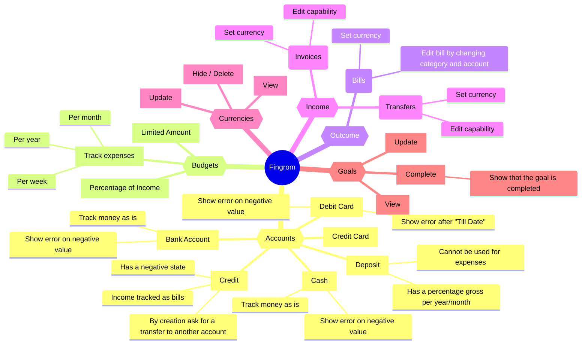

# Fingrom: Design Flow

## Structural Mind Map

```mermaid
mindmap
  root((Fingrom)
    {{Accounts}}
    ::icon(fas fa-coins)
      [Bank Account]
        Track money as is
        Show error on negative value
      [Cash]
        Track money as is
        Show error on negative value
      [Debit Card]
        Show error on negative value
        Show error after "Till Date"
      [Credit Card]
      ::icon(fas fa-tasks)
      [Deposit]
      ::icon(fas fa-tasks)
        Cannot be used for expenses
        Has a percentage gross per year/month
      [Credit]
      ::icon(fas fa-tasks)
        By creation ask for a transfer to another account
        Has a negative state
        Income tracked as bills
    {{Budgets}}
    ::icon(fas fa-wallet)
      [Track expenses]
      ::icon(fas fa-tasks)
        Per week
        Per month
        Per year
      [Percentage of Income]
      [Limited Amount]
    {{Outcome}}
    ::icon(fas fa-money-check-alt)
      (Bills)
        Set currency
        Edit bill by changing category and account
    {{Income}}
    ::icon(fas fa-hand-holding-usd)
      (Invoices)
        Set currency
        Edit capability
      (Transfers)
        Set currency
        Edit capability
    {{Currencies}}
    ::icon(fas fa-coins)
      [View]
      [Update]
      ::icon(fas fa-tasks)
      [Hide / Delete]
      ::icon(fas fa-tasks)
    {{Goals}}
    ::icon(fas fa-bullseye)
      [View]
      [Update]
      [Complete]
        Show that the goal is completed 
```