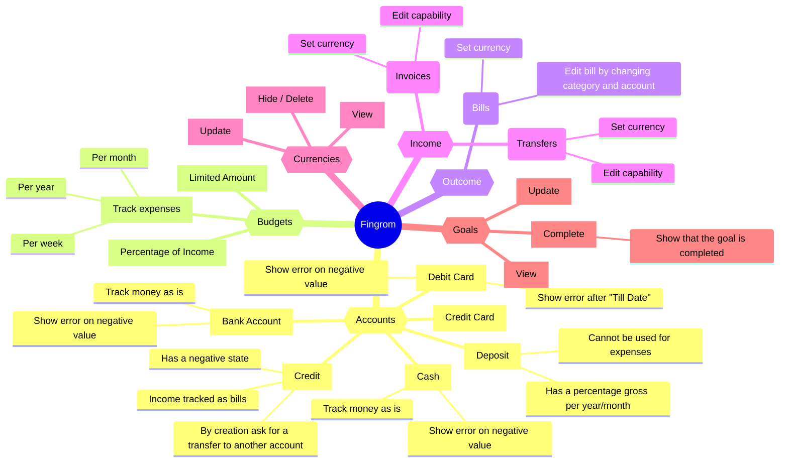
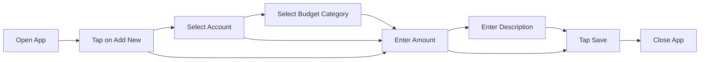
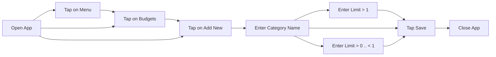

# Fingrom: Design Flow

## Structural Mind Map

## User Flows

A user flow encompasses any conceivable path a customer might traverse within a website or application. Additionally, 
the term "user flow" can extend to denote a visualization or map illustrating this journey, often referred to as a 
flowchart or UX flow.

### Add new Bill

### Add new Budget Category

